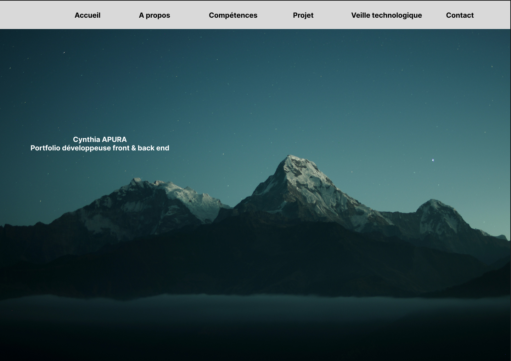
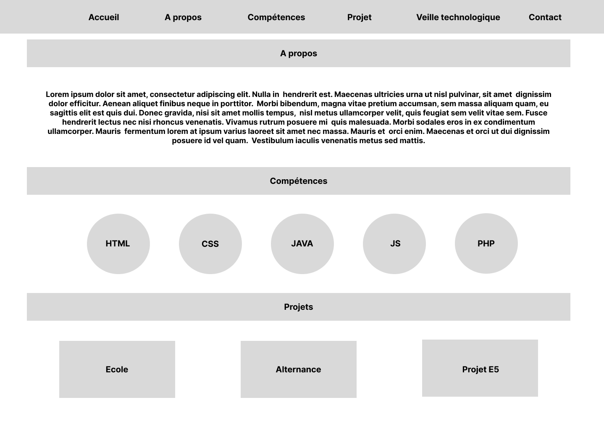
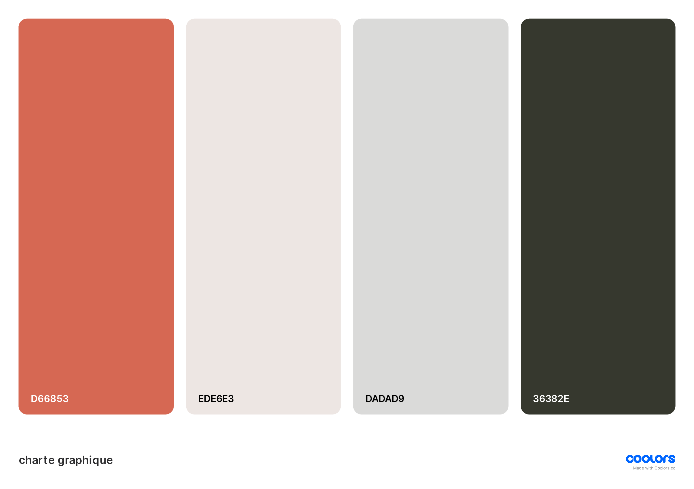
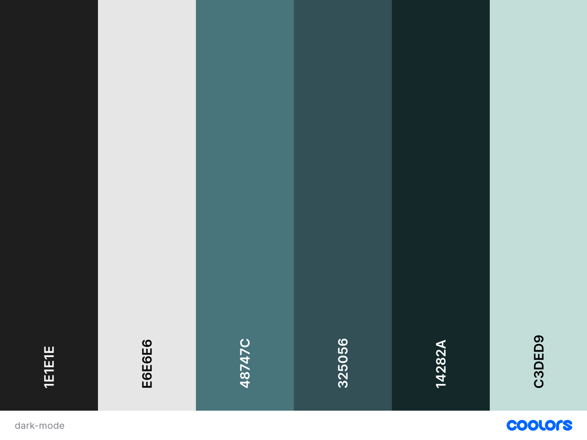

# Création d'un portfolio pour le BTS

## Présentation

[Lien vers la page](https://cynthiaapura.github.io/portfolio/)

### Wireframe

J'ai créer un wireframe pour avoir une idée du rendu final de mon portfolio.

Page principale : 

____

### Charte Graphique 
Pour ma charge graphique j'ai choisi des nuances vertes
Pour le light mode :

Pour le dark mode j'ai voulu rester dans les mêmes tons :

Pour mon icone, j'ai voulu faire simple en gardant la couleur dominante de mon site en y ajoutant mes initales.

____

